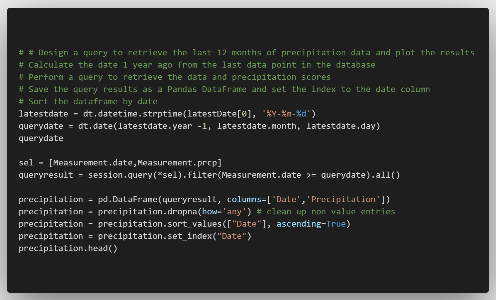
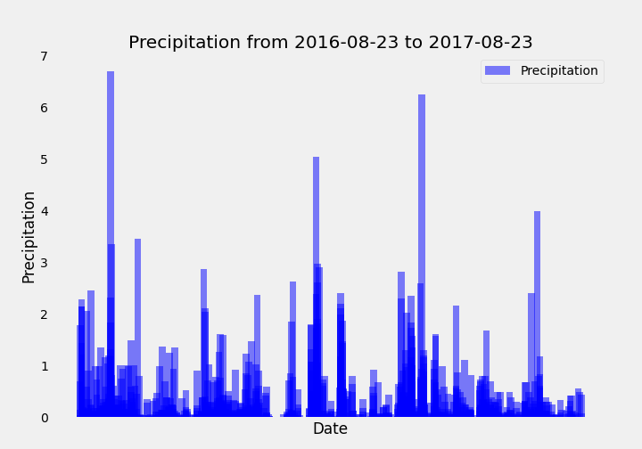
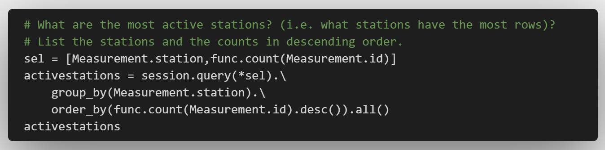
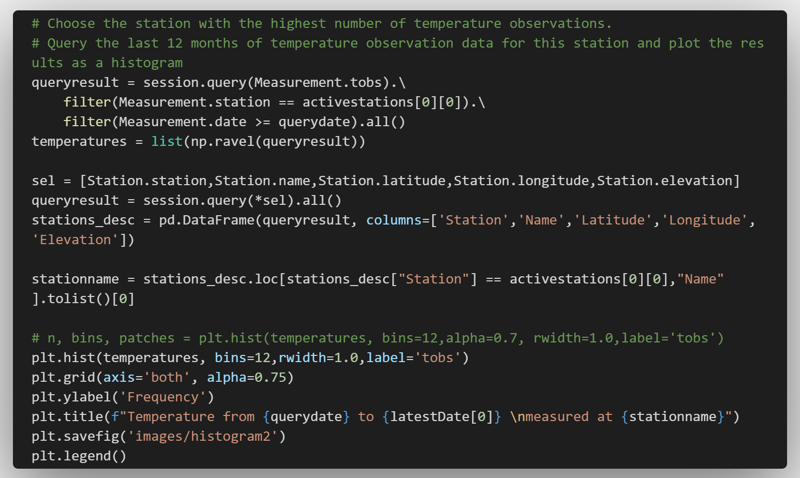
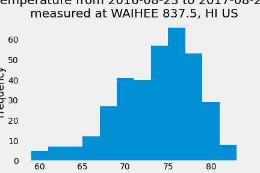
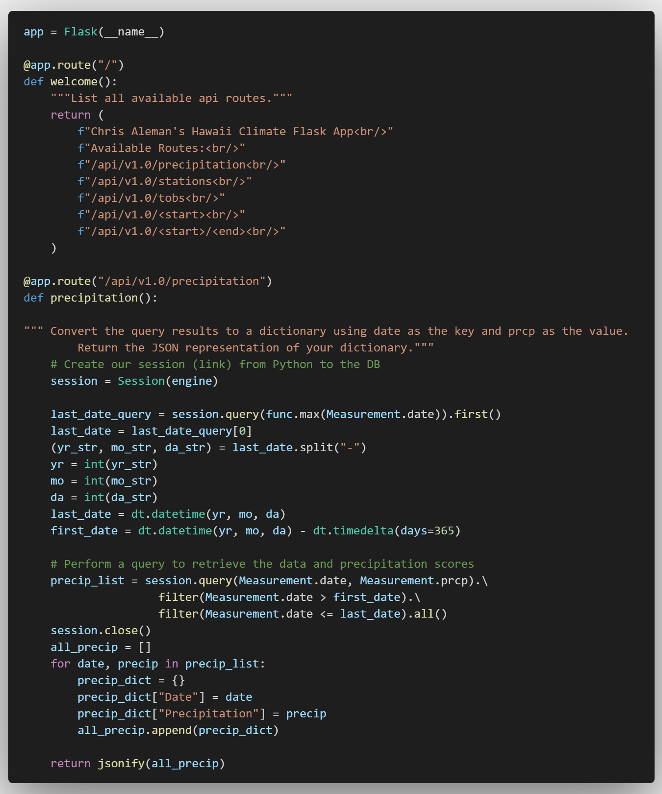

# Surfs Up!

## Repository information

File size: 10 MB

Code can be run using Visual Studio Code or Jupyter Notebook

Python and SQLAlchemy are used for basic climate analysis and data exploration of the given climate database.  Using Flask, a Climate App is created for data visualization.

## Climate Analysis and Exploration

### Precipitation Analysis

* Design a query to retrieve the last 12 months of precipitation data.

* Load the query results into a Pandas DataFrame and set the index to the date column.

* Plot the results using the DataFrame `plot` method.

### Station Analysis

* Design a query to calculate the total number of stations.

* Design a query to find the most active stations.

  * List the stations and observation counts in descending order.

  * Which station has the highest number of observations?

  

* Design a query to retrieve the last 12 months of temperature observation data (TOBS).

  * Filter by the station with the highest number of observations.

  

  * Plot the results as a histogram with `bins=12`.

  

## Climate App Flask Routes

